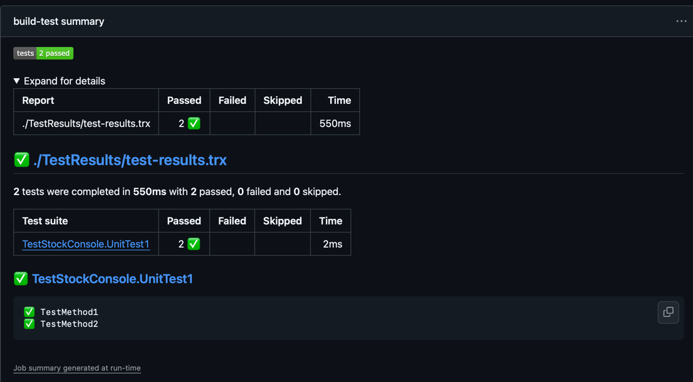

# Swat Project

[](https://github.com/OliverStaub/SwatStockConsole/actions/workflows/buildpipeline.yml)
[](https://github.com/OliverStaub/SwatStockConsole/actions/workflows/codecoverage.yml)
[](https://github.com/OliverStaub/SwatStockConsole/actions/workflows/codecoverage.yml)
[](https://sonarcloud.io/project/overview?id=OliverStaub_SwatStockConsole)
[](https://docs.github.com/code-security/dependabot/dependabot-version-updates)

## Setup

In the StockConsole Project create a .env File with this content:

```
ALPHA_API_KEY=your-alpha-vantage-key
ALPHA_API_URL=https://www.alphavantage.co/query?function={function}&symbol={symbol}&apikey={apiKey}
```

You can get your API Key here: https://www.alphavantage.co/support/#api-key

Make sure the file is getting copied to the output directory.

## AI generated Documentation

The Github Pages are deploayed here:
https://OliverStaub.github.io/SwatStockConsole/c4_documentation.html

## Git

Wir nutzen den main und develop branch.

## Pipelines

### Build Pipeline

The build Pipeline generates a summary about the tests that have been run.


### Code Coverage Pipeline

The code coverage Pipeline generates a detailed report that can be downloaded.
